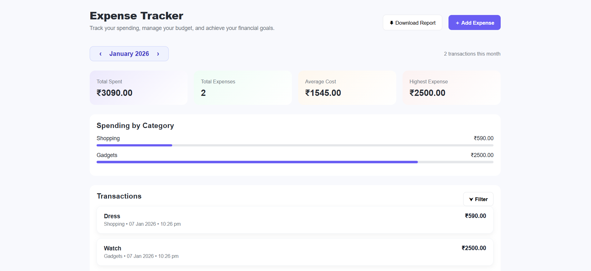
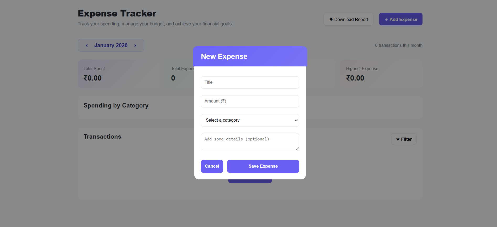
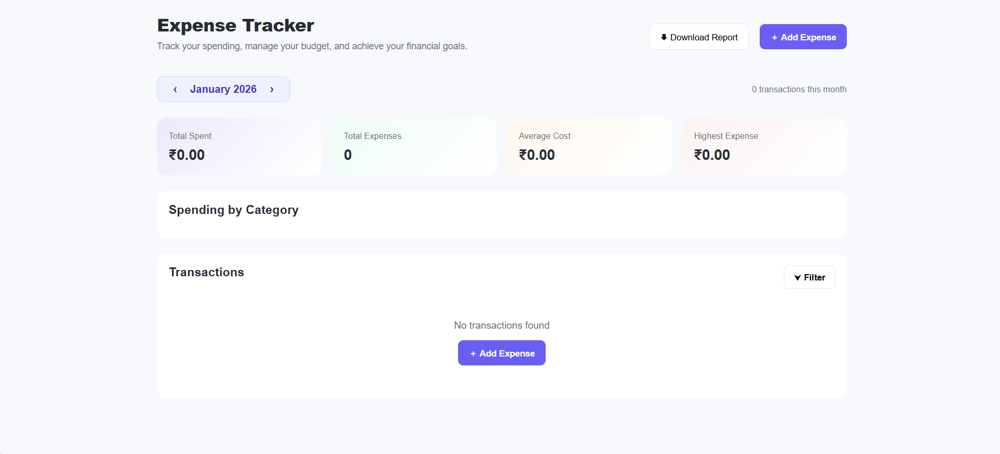

# Expense Tracker Web Application


A modern, responsive **Expense Tracker** web application that helps users track monthly expenses, analyze spending by category, and download reports. The app supports **month-wise transactions**, **Firebase Firestore** storage, and a clean, professional UI.

---

## Table of Contents

1. [Overview](#overview)
2. [Features](#features)
3. [Built With](#built-with)
4. [Project Structure](#project-structure)
5. [How It Works](#how-it-works)
6. [Screenshots](#screenshots)
7. [How to Run the Project](#how-to-run-the-project)
8. [Future Enhancements](#future-enhancements)
9. [Author](#author)

---

## Overview

Managing personal expenses can be difficult without proper tracking. This **Expense Tracker Web Application** allows users to:

- Add daily expenses
- View expenses month-wise
- Analyze spending patterns
- Download monthly expense reports

The project is designed with a **user-friendly interface**, making expense management simple and effective.

---

## Features

- Add expenses with title, amount, category & description  
- Month-wise navigation  
- Spending summary & category-wise breakdown  
- Filter transactions (date, amount, category, alphabetical)    
- Download monthly expense report (CSV)  
- Clean & responsive UI design  

---

## Built With

- **Frontend:** HTML5, CSS3, JavaScript (ES Modules)
- **Backend / Database:** Firebase Firestore
- **Tools:** VS Code, Firebase Console, GitHub

---

## Project Structure
```md
expense-tracker/
│
├── index.html 
├── style.css 
├── firebase.js 
│
├── js/
│ ├── main.js 
│ ├── state.js 
│ ├── ui.js 
│ ├── modal.js 
│ ├── expenses.js 
│ ├── filter.js 
│ └── month.js 
│
└── README.md
```

---

## How It Works

1. User selects a month using navigation arrows  
2. Expenses are fetched from Firestore based on the selected month and year  
3. Summary cards update dynamically based on the data  
4. Transactions are displayed with date, time, and category  
5. If no transactions exist, an empty-state message is shown  
6. Users can download the monthly expense report as a CSV file  

---

## Screenshots

<p align="center">
  
  
  
</p>

---

## How to Run the Project

### 1. Clone the Repository
```bash
git clone https://github.com/rashmi-devadiga/Expense-Tracker.git
cd Expense-Tracker
```
### 2. Firebase Setup
1. Go to Firebase Console & Create a new project
2. Enable Firestore Database
3. Create a Web App and copy the Firebase configuration
4. Paste the configuration into firebase.js
### 3. Run the App
Open index.html in your browser
*(Or use Live Server in VS Code)*

---

## Future Enhancements

- User authentication (Login / Signup)
- Mobile-first UI improvements
- Charts & analytics (monthly comparison)
- Export reports to PDF

---

## Author
**Rashmi Devadiga**  
Bachelor of Computer Applications Graduate  
[LinkedIn](https://linkedin.com/in/rashmidevadiga) | [GitHub](https://github.com/rashmi-devadiga)

